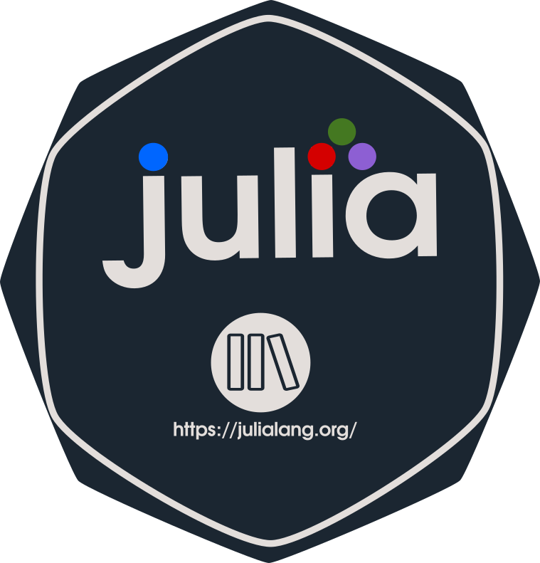

# Curso-Taller Julia-IIMAS-v1.0

El lenguaje de programación Julia es un lenguaje de alto nivel orientado hacia el cómputo científico.Posee una sintaxis muy familiar a otros lenguajes de alto nivel como Python o Pearl, su desempeño se acerca a los lenguajes más potentes como C o Fortran. Es una alternativa libre, expresiva, amigable y veloz para implementar y ejecutar algoritmos que demandan alta carga computacional. Julia ofrece muchas ventajas sobre otros lenguajes de alto nivel como los son: un conjunto de declaraciones de tipos extenso y variado, el entorno de compilación LLVM de código nativo, despacho múltiple, paralelismo,entre muchas otras. Este lenguaje fue diseñado para hacer sencilla la codificación al mismo tiempo que logra incrementar la velocidad en la ejecución del código. En poco tiempo Julia se ha posicionado como una herramienta ideal para científicos, tecnólogos, investigadores, estudiantes y docentes interesados en desarrollar aplicaciones dirigidas al cómputo científico y de alto rendimiento.

Por estas razones, además de nuestro gusto por conocer nuevos lenguajes de programación motivantes, nos dimos a la tarea de recopilar el código de Julia que hemos estado estudiando y elaborando para ampliar la cobertura de Julianos en nuestra comunidad universitaria.

Agradecemos a la DGAPA-UNAM por apoyar el programa PAPIIT-IA104720 que nos permite llevar acabo este intercambio de conocimiento Juliano.

### INSTRUCTORES:
Oscar Alejandro Esquivel

Óscar Anuar Alvarado Morán

Mario Horacio Garrido Czacki

### FECHAS
02/08/2020-06/08/2020

### CONTENIDOS
- Presentación de Julia
- Elementos básicos
- Despacho múltiple y rendimiento
- Ecosistema de Julia
- Introducción al paralelismo
- Caso de aplicación

**Agradecemos a la DGAPA-UNAM por apoyar el programa PAPIIT-IA104720 que nos permite llevar acabo este intercambio de conocimiento Juliano.**
